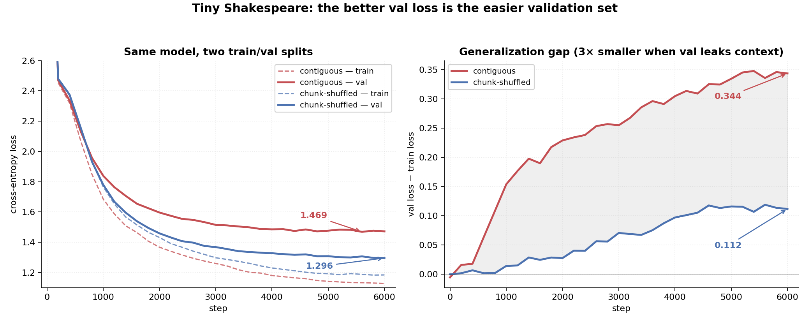

# Does your validation split flatter your model?

A small character-level transformer on tiny Shakespeare, trained twice. Same
model, same hyperparameters, same number of steps. The only thing that changes
is how the train/validation split is made.

One split gives a val loss of **1.296**. The other gives **1.469**. The model
is not better in the first case — the validation set is easier.

---

## The two splits

**Contiguous.** Hold out the last 10% of the text. This is what nanoGPT does.
The held-out text is a different stretch of the play: different scenes,
different speakers.

**Chunk-shuffled.** Cut the text into 1024-token chunks (4× the context
length), shuffle the chunks with a fixed seed, hold out 10% of them. Each
chunk is still internally contiguous, so training sequences mostly come from
coherent passages — but validation chunks now sit *between* training chunks,
drawn from the same scenes.

## Results

| | contiguous | chunk-shuffled |
|---|---|---|
| best val loss | 1.4689 | 1.2960 |
| final train loss | 1.1284 | 1.1843 |
| final val loss | 1.4723 | 1.2960 |
| **train/val gap** | **0.344** | **0.112** |
| val improved in last 10 evals | 3 / 10 | 7 / 10 |



The gap is the interesting number. Train loss ends up about the same in both
runs, so the model has not learned more — the validation set has just moved
closer to the training set. Three times closer, by this measure.

The curve shapes say the same thing. Contiguous val loss flattens around step
4000 and then bounces around (1.4855, 1.4867, 1.4747, 1.4847, 1.4723), which
is ordinary overfitting onset. Chunk-shuffled val loss is still setting new
bests at step 6000 and tracks the train curve down instead of separating from
it — the behaviour you would expect when validation passages share scenes,
speakers and phrasing with training passages.

## So which split is right?

Neither is clean, which is part of the point.

Contiguous holds out text the model has genuinely never seen, but it is also a
mild distribution shift: a different part of the play, not just different
samples from the same distribution. Some of the 1.469 is difficulty that has
nothing to do with generalization.

Chunk-shuffled keeps the distribution matched but leaks context. On a corpus
this small there may be no split that is both.

The practical takeaway is narrow and not novel: on a small, non-i.i.d. corpus,
**a validation number is only meaningful next to the split that produced it**.
Reporting 1.296 as an improvement over a published 1.48 would be wrong, and
nothing in the training logs alone would tell you that.

## Caveats

- One seed per split. The gap is large enough that seed noise is unlikely to
  explain it, but this is not a variance-controlled result.
- One dataset, one model size. No claim that the 3× gap ratio transfers
  anywhere else.
- Character-level tiny Shakespeare is a toy. The effect is easier to see here
  than it would be on a large, genuinely i.i.d. corpus.

---

## The model

A small GPT-style decoder, written to be read rather than to be fast:

- multi-head causal self-attention, mask registered as a buffer
- pre-norm residual blocks (`x + attn(ln(x))`, `x + ff(ln(x))`)
- GELU feedforward with 4× expansion
- learned token and position embeddings
- AdamW with cosine annealing, best-val checkpointing

~12.7M parameters at the config below. Trains in a few hours on a laptop GPU.

```
input_dim   256      block_size  256      dropout   0.1
num_heads   8        batch_size  32       lr        3e-4
num_layers  8        max_iters   6000
```

**Provenance, since it matters:** the initial model scaffold was drafted with
an LLM and then rewritten, debugged, and extended by me. The experiment,
the splits, the analysis and the conclusions are mine. I would rather say that
than let a reader assume I wrote every line of the attention block from
scratch.

## Layout

| file | what it does |
|---|---|
| `config.py` | hyperparameters, paths, and the `split_method` flag |
| `model.py` | attention, feedforward, decoder block, `SmallLM` |
| `data.py` | char tokenizer, batching, both split functions |
| `train.py` | training loop, checkpointing, jsonl metric logging |
| `generate.py` | load a checkpoint and sample from it |
| `notebooks/results.ipynb` | reproduces the figure and the table from the logs |
| `logs/` | the two runs behind the numbers above |

## Running it

Needs `torch`, `numpy` and `matplotlib`. Put `shakespeare.txt` in the repo
root ([tiny Shakespeare](https://raw.githubusercontent.com/karpathy/char-rnn/master/data/tinyshakespeare/input.txt)).

```bash
# in config.py: split_method = "chunk"   (or "tail")
python train.py
python generate.py
```

Each run writes `logs/train_{split_method}_{timestamp}.jsonl` and checkpoints
to `checkpoints/{split_method}/model.pt`, so the two runs never overwrite each
other. Both logs are committed — `results.ipynb` regenerates the figure and
the table without retraining anything.

## License

MIT.
